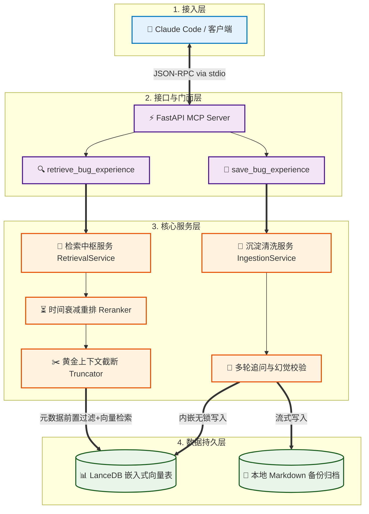

# BugVault 系统架构与高级设计说明书

本说明书承袭工程化智慧（如门面模式、元数据前置过滤等），结合现代大模型智能体（Agent）的端侧落地标准，为 **BugVault** 提供了完整的系统架构与模块设计。该系统旨在为 Claude 提供强结构化的排障专属长期记忆，确保在沉浸式编码（Vibe Coding）场景中具备高稳定性、极低延迟以及 Token 经济性。

## 一、 设计哲学与核心原则

为了彻底解决传统 RAG 系统在端侧运行时的臃肿、卡顿及格式幻觉，BugVault 遵循以下底层软件开发思想：

- **极致的门面模式（Facade Pattern）**：对外部客户端（Claude）隐藏复杂的本地数据链。Claude 只需与极简的 MCP 工具接口交互，无需感知底层的向量计算、混合重排与文件 I/O。
- **单一职责与数据解耦**：MCP 协议接入、业务逻辑控制、底层数据访问三层彻底分离。全系统以纯本地的 Pydantic 模型（`BugRecord`）作为通用法定货币，消除数据流转中的硬编码开销。
- **逆向“小块检索，大块生成”思想**：在菜谱项目中，系统检索小块并拼装大块父文档以提供完整上下文。而在 BugVault 场景中，为了防止长篇报错死栈撑爆大模型的上下文窗口，系统采用**存储大块、精确检索、信息截断**的逆向适配策略，只向大模型吐出浓缩后的黄金排障路径。

## 二、 系统架构图

系统的整体分层与数据流转架构如下图所示。该架构采用进程内嵌式设计，去除了多余的网关与外部服务进程，保障个人开发者的高效、安全体验。



## 三、 核心模块详细设计

### 3.1 协议接口层 (`mcp_tools/`)——门面模式的落地

该层是系统的唯一对外视窗，不包含任何业务判断，严格限定为“参数转发器”。

- **输入校验与 Schema 映射**：直接利用 Pydantic 模型的 `.model_json_schema()` 自动向 Claude 生成 MCP 标准的输入描述。

- **统一门面接口**：

  | **工具名称**              | **暴露的参数**                          | **门面内部职责**                                    |
  | ------------------------- | --------------------------------------- | --------------------------------------------------- |
  | `retrieve_bug_experience` | `query` (报错文本), `tech_stack` (可选) | 转发至检索中枢，获取压缩后的历史有效/无效排障方案。 |
  | `save_bug_experience`     | `BugRecord` 强校验核心字段              | 转发至沉淀清洗服务，启动入库与多轮追问逻辑。        |

### 3.2 核心服务层 (`services/`)——排障策略中枢

承担系统的全部业务逻辑，包含两套核心服务：

#### 3.2.1 检索服务 (`retrieval_svc.py`)

1. **元数据前置过滤（借鉴菜谱项目分类检索）**：若参数中携带 `tech_stack`，首先在底层索引中锁定该技术栈的记录，拒绝跨语言、跨框架的无效向量污染。

2. **时间衰减重排（Time Decay Rerank）**：计算最终相似度分数时引入时间系数。

   $$\text{Final\_Score} = \text{Vector\_Similarity} \times e^{-\lambda \cdot \Delta t}$$

   其中 $\Delta t$ 为 Bug 创建至今的时间差。借此让一年前的旧版本 Bug（如已废弃的旧 API 报错）自动降权，防止将 Claude 带偏。

3. **黄金上下文截断机制（防 Context 撑爆）**：向量库召回的原始记录可能包含几百行的错误日志（`error_log_snippet`）。服务层在组装发送给 Claude 的上下文时，会执行强制截断：只保留报错的头尾关键行，并高亮 `tried_methods`（防止重复踩坑）与 `final_solution`（核心参考方案），整体单条记录控制在 500 字符内。

#### 3.2.2 沉淀服务 (`ingestion_svc.py`)

1. **异常捕获与追问机制（防幻觉）**：当 Claude 调用 `save_bug_experience` 时，服务层对传入的字段进行严密逻辑校验。若大模型产生幻觉，导致 `final_solution` 或 `tried_methods` 为空字符串或语义不明，系统**禁止强行写入**。
2. 接口会捕获异常，并向 Claude 返回特定的协议指令：`{"status": "need_refinement", "missing_field": "final_solution"}`。以此触发 Claude 的系统提示词逻辑，使其在控制台中主动向开发者追加提问，补全信息后再重新发起保存。

### 3.3 数据持久层 (`database/`)——进程内嵌入式高速存储

实现存储引擎的完全解耦，提供极速响应。

- **LanceDB 列式检索**：基于 Apache Arrow 开发的 `lancedb_client.py` 充当数据存储网关。利用列式存储的特性，将 `tech_stack` 和 `project_name` 建立二级索引，实现毫秒级的属性前置过滤。
- **多版本并发无锁控制（MVCC）**：利用 LanceDB 的无锁机制，确保开发者在频繁修改代码、高频热重载时，Claude 对 Bug 数据库的**高频并发读、写**不会触发任何类似 SQLite 的 `database is locked` 异常。

## 四、 系统生命周期与数据流转时序

系统的高效运行依托于**检索流**与**沉淀流**两条独立且互不干扰的生命周期线。

### 4.1 在线智能检索流 (Retrieval Pipeline)

当沉浸式编码过程中遇到深度排障场景时，时序流动如下：

```
Claude (客户端) ----> 1. 发起 retrieve_bug_experience 请求 ----> mcp_tools (接口层)
                                                                   │
                                                               2. 参数解析与转发
                                                                   ▼
FastAPI Server <---- 4. 返回信息截断后的黄金排障上下文 <---- services (核心服务层)
      │                                                            ▲
3.1 执行 tech_stack 元数据前置过滤                                 │
3.2 计算时间衰减因子重排 (Rerank) ─────────────────────────────────┘
```

### 4.2 离线无感沉淀流 (Ingestion Pipeline)

当开发者确认“Bug 修复，验证通过”时，经验资产的沉淀时序如下：

```
Claude (客户端) ----> 1. 自动梳理上下文，发起 save_bug_experience ----> mcp_tools (接口层)
                                                                            │
                                                                     2. Pydantic 强校验
                                                                            ▼
Claude (控制台) <─── [异常分支] 3.2 字段残缺 -> 触发多轮追问引导 ─── services (核心服务层)
                                                                            │
                                                                     [正常分支] 3.1 校验通过
                                                                            ▼
本地硬盘归档   <──── 4.2 生成人性化排障笔记 (.md) <─────────────────── database (持久层)
                                                                            │
                                                     4.1 MVCC 无锁写入 ─────┘
                                                                            ▼
                                                                        LanceDB
```

## 五、 隐藏工程缺陷防御方案

为了确保 BugVault 在交付至 MCP 社区并在用户机器上冷启动时的绝对稳定性，架构在底层设计上做了两项硬核防御：

### 5.1 标准输出（`stdout`）绝对纯净保障

- **潜在风险**：MCP 本地协议基于 `stdio` 通信，任何底层的 `print()` 或第三方库的日志输出若混入 `stdout`，都会导致 Claude 解析 JSON 失败，服务直接崩溃。
- **防御实现**：系统在 `main.py` 入口处对系统环境执行强力干预。重写全局 `logging` 配置，将所有日志级别在 `INFO` 及以上的输出全部强行重定向至全局标准错误流 `sys.stderr`，或者定向至用户本地隐藏目录下的 `bugvault_runtime.log`。严格确保 `sys.stdout` 只流淌符合 JSON-RPC 规范的纯净数据。

### 5.2 异步事件循环保护（Asyncio Thread Isolation）

- **潜在风险**：MCP 官方 Python SDK 强制基于 `asyncio` 异步循环运行。而 LanceDB 的某些向量计算与本地 Markdown 文件写入属于 CPU 密集型/同步阻塞 I/O 操作，直接调用会卡死主线程，导致 Claude 触发超时丢包。
- **防御实现**：服务层在调用 `lancedb_client` 的所有读写方法时，统一不使用同步阻塞写法，而是采用 `asyncio.to_thread()` 将同步的磁盘写入与哈希计算分发给底层的独立线程池（Worker Threads）。这样可以确保 FastAPI 的 MCP 主事件循环在任何高频并发冲击下，依然能对 Claude 的请求保持毫秒级的实时响应。